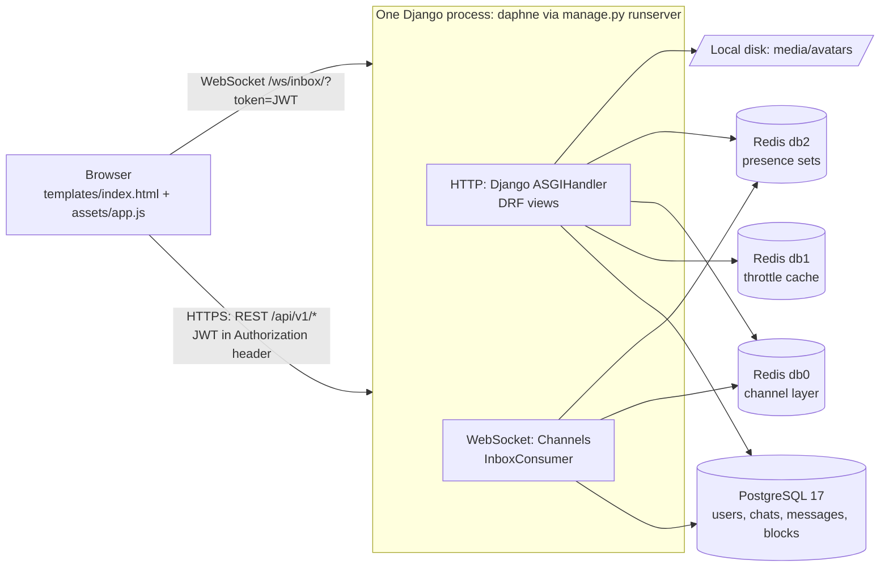
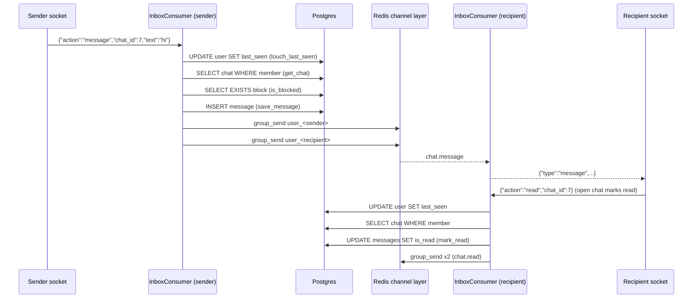

# 1. Repository audit

Audit date: 2026-10-09. Commit audited: `3bd73a8` (Initial commit) plus the
uncommitted load test (`loadtest/`, `chats/management/commands/loadtest_seed.py`).

Every finding below has an **evidence level**:

| Label | Meaning |
|---|---|
| **Confirmed (measured)** | Reproduced or measured on this machine. |
| **Confirmed (code)** | Follows directly from the code or library source; not yet reproduced by a test. |
| **Likely** | Strong reasoning from framework behaviour, but needs a test to confirm. |
| **Risk** | Could become a problem under conditions we have not observed (traffic, deployment choices). |

---

## Status update · 2026-10-10

This audit was written against commit `3bd73a8`. GitHub's `main` had already moved on
(`763c9da`…`d00f461`, 2026-10-06 to 10-08), and the local copy hadn't been synced. Line numbers
below may be off by a few lines. Current status of the findings that changed:

| Finding | Status | Where |
|---|---|---|
| SEC-1 committed `SECRET_KEY` | **Fixed:** read from env; the old key is burned; forged-token tests. | `763c9da`, PR #6 |
| SEC-2 production settings | **Fixed:** `DEBUG`/`ALLOWED_HOSTS` from env, production HTTPS settings, `check --deploy` in CI. | `763c9da`, PR #6 |
| SEC-5 message size | **Size fixed** (`MAX_MESSAGE_LENGTH = 4000` in REST and WS). The rate limit is **still open**. | `902e2b8` |
| SEC-6 avatars | **User files removed from git**, `media/` ignored. No size limit and local disk: **still open**. | `763c9da` |
| SEC-10 / OPS-3 dependencies | **Fixed:** complete pins from `requirements.in`, psycopg 3, `pip-audit` in CI, Dependabot. | `763c9da`, `6267925`, PR #7 |
| OPS-1 / OPS-2 tests and CI | **Mostly fixed:** 48 tests (REST + WebSocket), CI with Ruff, tests and `makemigrations --check`. See T-11 for what's left. | `902e2b8` |
| OPS-7 config split | **Fixed.** | `763c9da` |

Still open, re-checked against the current code: SEC-3, SEC-4, SEC-7, SEC-8, SEC-9, every COR
finding (COR-3: the existing test covers bad JSON and unknown actions, but not a JSON array or a
numeric `text`), and every PERF finding.

## 1.1 What was inspected

All 40 tracked files were read in full (2,307 lines). In addition:

- Library source in `.venv` for the behaviours the conclusions depend on:
  `channels/db.py`, `asgiref/sync.py`, `django/core/handlers/asgi.py`,
  `daphne/server.py`, `channels_redis/core.py`, `rest_framework_simplejwt/settings.py`.
- The live dev database (Docker Postgres 17): `max_connections`, indexes, `EXPLAIN` of the chat list query.
- SQL captured per endpoint with `CaptureQueriesContext`.
- Timings: password check, Postgres connect, trivial query.
- `manage.py check --deploy`.
- GitHub repository visibility (public).
- The load test run from the previous session (`loadtest/run.py`), including the server log.

**Not inspected / not available** (each is an open question in [02-plan.md](02-plan.md#21-unknowns-we-must-measure-or-decide)):

- Any production deployment. There is no evidence the app is deployed anywhere. No
  hosting config, Dockerfile, CI, or infrastructure-as-code exists in the repo.
- Real traffic, real user counts, real data sizes.
- The GitHub repo itself through the GitHub API (the GitHub connector failed to
  authenticate in this session). The local clone was used instead; `origin/main`
  matches the local `main`.

---

## 1.2 Architecture overview

### Components

| Component | Where | Role |
|---|---|---|
| `root/asgi.py` | entry point | Routes `http` to Django, `websocket` to Channels behind `AllowedHostsOriginValidator` + `JWTAuthMiddleware`. |
| `accounts/` | app | Custom `User` (phone number login), register/login/refresh (SimpleJWT), profile, lookup by phone, public profile. |
| `accounts/authentication.py` | auth | `LastSeenJWTAuthentication`: JWT auth that also writes `last_seen` at most once a minute. |
| `chats/models.py` | data | `Chat` (exactly two users, `user1 < user2` enforced by a check constraint), `Message`, `Block`. |
| `chats/views.py` | REST | Chat list/create, message list/create, mark read. |
| `chats/consumers.py` | WebSocket | `InboxConsumer`: one socket per signed-in user carrying every chat. Handles `message`, `read`, `ping`. |
| `chats/presence.py` | Redis | Online status: one Redis set per user of open socket names, 90 s TTL refreshed by pings. |
| `assets/app.js` | client | Vanilla JS SPA. Tokens in `localStorage`. Pings every 30 s, reloads chat list every 45 s. |

### Request lifecycles

**A. REST request (for example `GET /api/v1/chats/`)**

1. Daphne receives HTTP and hands it to Django's `ASGIHandler`.
2. Django opens a **new thread context for this request**
   (`django/core/handlers/asgi.py:172`, `async with ThreadSensitiveContext()`),
   so the synchronous DRF view runs on its own thread.
3. `LastSeenJWTAuthentication` decodes the JWT, loads the user (1 query), maybe updates `last_seen` (1 query).
4. The view runs its queries. Each request opens its **own new Postgres connection**,
   because `CONN_MAX_AGE` is not set (default `0` = close after every request).
5. The response is serialized to JSON and returned.

**B. WebSocket connect (`/ws/inbox/?token=...`)**

1. `AllowedHostsOriginValidator` checks the `Origin` header against `ALLOWED_HOSTS`.
2. `JWTAuthMiddleware` (`chats/middleware.py`) validates the token from the query string and loads the user (1 DB call).
3. `InboxConsumer.connect` (`chats/consumers.py:55`): joins Redis group `user_<id>`, accepts,
   adds the socket to the presence set (Redis), updates `last_seen` (DB).

**C. Sending a message over the socket (the hot path)**

So one delivered and read message costs **7 database round trips and 4 channel-layer sends**.
This number drives the capacity model in [02-plan.md](02-plan.md#23-capacity-model-what-actually-limits-this-app).

### Things the codebase already does well

It's worth knowing these, because you'll be asked "what was good about the original design?":

- **One socket per user, not per chat** (`group_for_user`, `chats/consumers.py:17`). Messages
  reach the user whichever chat is open. That's the right design for a messenger, and it
  scales horizontally because routing goes through Redis.
- **Membership-scoped queries.** Every chat and message lookup filters by the requesting
  user (`chats_for()` in `chats/views.py:17`, `get_chat()` in the consumer). I found no
  insecure direct object reference on chats or messages.
- **No N+1 queries.** The chat list uses `select_related` and builds presence for the
  whole page in one Redis pipeline (`presence.online_map`). Measured: 4 queries per chat
  list request regardless of chat count.
- **XSS hygiene in the client.** `app.js` builds the DOM with `textContent` everywhere
  (for example `messageRow`), never `innerHTML` with user data.
- **Database constraints that encode invariants**: `chat_users_ordered` (`user1 < user2`)
  plus `unique_together` makes duplicate chats impossible even under races;
  `get_or_create` handles the `IntegrityError` retry.
- **Presence with TTL**: a crashed process can't pin someone "online" forever.
- **Blocks reported as "No such user"**, so blocking is not detectable.

---

## 1.3 Confirmed findings: security

### SEC-1 · Critical · `SECRET_KEY` is committed to a public repository. Confirmed (code + GitHub API)

- **Where:** `root/settings.py:13`. The repo `sanjarbek-ashurboyev/OnlineChat` is public (`private: false`).
- **Plain English:** the secret that proves a login token is genuine is published on the internet.
- **Mechanism:** SimpleJWT signs tokens with `SIGNING_KEY`, which defaults to
  `settings.SECRET_KEY` (`rest_framework_simplejwt/settings.py:20`, verified). With
  the key, anyone can create a valid access token for **any `user_id`** without a password,
  and use it on the REST API and the WebSocket.
- **Impact:** full account takeover of every user on any deployment that uses this key.
  Django also uses `SECRET_KEY` for sessions (admin login), password-reset tokens and signing.
- **Fix:** read the key from the environment, generate a new one, and treat the old key as
  burned forever. Deleting it from git history does not help: forks and clones already have it.
  Rotating the key logs everyone out, which is acceptable.
- Task: **T-01**.

### SEC-2 · High · Production-unsafe settings are hard-coded. Confirmed (code + `check --deploy`)

- `DEBUG = True` (`root/settings.py:15`), `ALLOWED_HOSTS = []` (`:17`).
- `check --deploy` reports W004 (HSTS), W008 (SSL redirect), W009 (insecure key), W012
  (session cookie not secure), W016 (CSRF cookie), W018 (DEBUG), W020 (ALLOWED_HOSTS).
- With `DEBUG=True`, an unhandled exception renders a page with stack frames, local
  variables, settings (partly masked) and SQL. Django also keeps every executed SQL
  query in memory per request, which looks like a memory leak under load.
- Task: **T-01**.

### SEC-3 · High · Login, registration and token refresh have no rate limit. Confirmed (code + measured)

- **Where:** `accounts/views.py:21-32`. Only `UserLookupAPIView` has a throttle
  (`throttle_scope = 'user_lookup'`, 20/hour).
- **Measured:** one password check costs **~200 ms of CPU** (PBKDF2-SHA256, 1,500,000
  iterations, Django 6.1 default). That slowness is deliberate and correct: it makes
  stolen hashes expensive to crack. But it means about **5 login attempts per second
  saturate one CPU core**.
- **Impact:**
  1. Online password guessing against any phone number.
  2. CPU exhaustion. A few dozen requests per second keep the server's cores busy, and
     the WebSocket thread needs CPU too.
  3. Unlimited fake account creation, which defeats every per-account limit (see SEC-4).
- Task: **T-03**.

### SEC-4 · High (privacy) · Anyone signed in can list every user and message anyone. Confirmed (code)

- **Where:**
  - `GET /api/v1/users/<int:pk>/`: `PublicUserAPIView`, `accounts/views.py:75`. No throttle.
  - `POST /api/v1/chats/` with `participant_id`: `ChatCreateSerializer.validate_participant_id`,
    `chats/serializers.py:44`. No throttle.
  - User IDs are sequential (`BigAutoField`).
- **Mechanism:** loop `pk = 1..N` over `/users/<pk>/` and you get every user's display
  name, avatar, online status and `last_seen`. Loop `POST /chats/` and you open a chat
  with every user, which lets you spam all of them. The phone lookup limit (20/hour)
  doesn't help, because it is **per account** and accounts are free (SEC-3).
- **Also likely:** registration reveals whether a phone number is registered. DRF adds a
  `UniqueValidator` for `phone_number` that answers "user with this phone number already exists".
  Needs a test to confirm the exact message.
- **Note:** phone numbers themselves are not exposed by these endpoints
  (`PublicUserSerializer` fields are `id, display_name, avatar, is_online, last_seen`). Good.
- **Product decision needed:** should a user be able to start a chat with anyone, or only
  with someone whose phone number they know? Today both are possible, so the phone
  lookup gives no protection.
- Tasks: **T-03**, **T-05**.

### SEC-5 · High · Messages have no size limit and no rate limit. Confirmed (code + library source)

- **Where:** `InboxConsumer.receive` (`chats/consumers.py:75-118`) and `MessageSerializer.text`
  (`TextField`, no `max_length`).
- **Limits that do exist:** Daphne caps a WebSocket message at **1 MiB**
  (`daphne/server.py:65`, verified). Django caps an HTTP body at 2.5 MB.
- **Amplification:** a 1 MiB message is stored once, sent to 2 sockets, **and returned as
  `last_message` in the victim's chat list every 45 s** (`app.js:544`), forever.
  One client looping on `send()` can add gigabytes per hour to Postgres.
- Task: **T-04**.

### SEC-6 · Medium · Avatar uploads: no size limit, local disk, and user files committed to git. Confirmed (code)

- `User.avatar` is an `ImageField` with no size validator (`accounts/models.py:47`).
  Pillow does validate that the file is an image and refuses decompression bombs above
  ~179 megapixels by default. But a 50 MB valid JPEG is accepted.
- Files go to local `media/`. That blocks running more than one server (each server
  would have different files) and fills the server's disk.
- Media is only served when `DEBUG=True` (`root/urls.py:20`), so a production deploy has
  no avatar serving at all yet.
- `media/avatars/*.png` (3 files) are **tracked in the public git repo**; `.gitignore` has no `media/`.
- Tasks: **T-06**, **T-31**.

### SEC-7 · Medium · Tokens cannot be revoked. Confirmed (code + library defaults)

- SimpleJWT defaults (no `SIMPLE_JWT` in settings): access 5 min, refresh **1 day**,
  no rotation, no blacklist.
- Logout only deletes tokens from `localStorage` (`app.js` `clearTokens`). A copied
  refresh token keeps working for 24 h, and there is no way to force-logout a compromised account.
- Tokens in `localStorage` are readable by any script on the page. I found no XSS today,
  but there's no Content-Security-Policy as defence in depth.
- Task: **T-07**.

### SEC-8 · Low · Access token travels in the WebSocket URL. Confirmed (code), Risk (logging)

- `chats/middleware.py` reads `?token=`. That's a common, accepted compromise: browsers
  can't set headers on WebSockets. The risk is that reverse proxies (for example nginx's
  default `combined` log format) write the full URL, token included, to access logs.
- Daphne itself did not log the token during the load test (0 matches in the log).
- Mitigation when a proxy is added: log `$uri`, not `$request_uri`, or exchange the JWT for
  a short-lived single-use "socket ticket". Task **T-20**.

### SEC-9 · Low (today) / High (if deployed as-is) · Redis and Postgres exposed with no Redis password. Confirmed (code)

- `compose.yaml` publishes `6379` and `5432` on `0.0.0.0`; Redis has no `requirepass`.
- If this compose file is used on a server with a public IP, anyone can connect to Redis
  and **inject channel-layer events, which deliver forged messages straight into any
  user's socket**, or read presence data.
- Task: **T-10**.

### SEC-10 · Low · Dependencies are unpinned and unscanned. Confirmed (code)

- `requirements.txt` lacks `channels`, `channels-redis`, `daphne`, `redis` and pins
  nothing for `djangorestframework-simplejwt`. There's no `pip-audit` / Dependabot.
- Task: **T-08**.

---

## 1.4 Confirmed findings: correctness

### COR-1 · High · Messages that arrive while the socket is reconnecting never appear in the open chat. Confirmed (code)

- **Plain English:** if your Wi-Fi blips for 10 s while a friend sends you three
  messages, those three messages never show up in the open conversation until you
  close and reopen it.
- **Mechanism:**
  1. Live delivery uses the Redis channel layer, which is **at-most-once**: fire and
     forget, nothing is replayed after a reconnect. `channels_redis` defaults also drop
     messages to a channel that has 100 pending (`capacity=100`) or that is older than
     60 s (`expiry=60`) (`channels_redis/core.py:110-112`, verified).
  2. On reconnect, `ws.onopen` (`app.js:387`) only re-sends a read receipt. It never
     reloads messages for the open chat.
  3. The 45 s poll refreshes the **sidebar preview**, not the conversation.
- **Why it matters at scale:** reconnects happen on every deploy, every network change
  and every server restart. With more users and more deploys, "lost" messages become
  routine support tickets. The messages are safe in Postgres, so this is a delivery and
  display bug, not data loss.
- Task: **T-09**.

### COR-2 · Medium · A failed `group_discard` skips the "mark offline" step. Confirmed (measured)

- `InboxConsumer.disconnect` (`chats/consumers.py:68-73`) calls `group_discard`, then
  `mark_offline`. In the load test, when 200 clients disconnected together, **97
  disconnects raised `redis.exceptions.MaxConnectionsError` at line 70**, so lines 72-73 never ran.
- **Effects:** the user shows "online" for up to 90 s (presence TTL). Their dead channel
  stays in the Redis group for up to 24 h (`group_expiry=86400`), so every message
  still gets sent to it and expires 60 s later. That wastes Redis memory and work.
- Task: **T-02**.

### COR-3 · Medium · Malformed WebSocket input crashes the consumer. Confirmed (code)

- `payload = json.loads(...)` then `payload.get(...)` (`chats/consumers.py:77-83`): a JSON
  array or number raises `AttributeError`. `text` that is a number raises on `.strip()`
  (`:104`). The exception kills the connection (close code 1011), and the client reconnects.
- Task: **T-04**.

### COR-4 · Low · Reconnect backoff has no jitter. Confirmed (code)

- `app.js:443`: `1000 * 2 ** retry`. After a server restart, every client retries at
  exactly 1 s, 2 s, 4 s... in lockstep, a **thundering herd**. Each reconnect costs a JWT
  check, a DB user load, presence and group writes.
- Task: **T-09**.

### COR-5 · Low · The client's "token expired, refresh then reconnect" branch probably never runs. Likely

- `app.js:438` expects close code `4401`. But `InboxConsumer.connect` calls `close(code=4401)`
  **before** `accept()`. In Channels, closing before accept rejects the HTTP handshake
  (403), and the browser reports code `1006`, not `4401`. The client then retries with the
  same expired token until the 45 s poll refreshes it.
- Verify with a `WebsocketCommunicator` test (task **T-09**).

### COR-6 · Low · Pagination order isn't unique. Confirmed (code)

- `order_by('-created_at')` (`chats/views.py:87`): two messages with an identical timestamp
  can swap between pages. Add `-id` as a tie-breaker (task **T-18**).

### COR-7 · Product gap · Blocking can't be used. Confirmed (code)

- The `Block` model and checks exist, but no endpoint creates or removes a block
  (`chats/urls.py`). Every message still pays for the `is_blocked` query
  (`chats/consumers.py:157`). Decide: build the endpoint, or keep the check and accept the cost.

### COR-8 · Note · Deleting a user deletes the other person's conversation too. Confirmed (code)

- `Chat.user1/user2` and `Message.sender` use `on_delete=CASCADE`. If user A deletes their
  account, user B loses the whole history with A. That's a product/privacy decision
  (right to erasure versus the other party's records), not a bug, but decide it consciously.

---

## 1.5 Confirmed findings: performance

### PERF-1 · All WebSocket database and Redis work in a process runs on one thread. Confirmed (library source)

- **Plain English:** imagine a bank with many customers queuing but only one teller for
  all "go to the database" errands from every open socket.
- **Mechanism:**
  - Consumers are `async`. To call the synchronous ORM they use `database_sync_to_async`
    and `sync_to_async`, which default to `thread_sensitive=True` (`asgiref/sync.py:629`).
  - Thread-sensitive calls run on **one shared thread per process** unless something
    opens a `ThreadSensitiveContext`. Django does that per HTTP request
    (`django/core/handlers/asgi.py:172`). **Channels does not do it per connection**
    (verified: no `ThreadSensitiveContext` anywhere in `channels/`).
  - So every `get_chat`, `save_message`, `touch_last_seen`, `presence.*` call from every
    socket queues for that one thread.
- **Why not "just give each socket its own thread"?** Then each socket would hold its own
  DB connection: 2,000 sockets would need 2,000 Postgres connections, against
  `max_connections = 100`. The fix is to make each trip to the teller fast and rare
  (PERF-2, PERF-3), then run more processes (more tellers). See
  [02-plan.md, stage 1](02-plan.md#stage-1--100--1000-online-users).

### PERF-2 · Every database call opens a new connection. Confirmed (measured)

- `CONN_MAX_AGE` is unset (0). `database_sync_to_async` calls `close_old_connections()`
  before and after each call (`channels/db.py:10-15`), so with 0 the connection closes every time.
- **Measured on this Mac (Docker Postgres):** connect **6.2 ms** median vs query **0.22 ms**.
  Opening the connection costs ~28× more than the query. Over a real network with TLS
  the gap is usually larger.

### PERF-3 · Seven DB round trips per delivered message, one per ping. Confirmed (code)

- See lifecycle C above. `touch_last_seen` runs on **every** incoming frame including
  pings (`chats/consumers.py:82`), while REST auth already limits the same write to once
  a minute (`accounts/authentication.py:8`).

### PERF-4 · The single-thread model explains the load-test result. Confirmed (measured + model)

The previous session's load test (single process, client on the same Mac): **100 online users
healthy, 200 failed** (message p95 1,538 ms). The arithmetic, with ~6.5 ms per DB call
(connect + query) on one thread:

| Load | Messages/s | DB calls/s (7/msg + 1/ping + polls) | Thread busy | Result |
|---|---|---|---|---|
| 100 users, 50% active, 10 msg/min | 8.3 | ≈ 58 + 3.3 + ~4 ≈ 65 | ≈ 42% | healthy |
| 200 users, same profile | 16.7 | ≈ 117 + 6.7 + ~9 ≈ 133 | ≈ 86% | p95 explodes |

Queueing theory says latency grows slowly up to ~70% utilisation, then explodes as
utilisation approaches 100%. That's exactly the jump between the two steps. This is a **model
consistent with the measurement**, not proof; task **T-12** confirms it with a profiler.

### PERF-5 · The chat list query is the most expensive request, and it runs twice. Confirmed (measured)

- **Where:** `ChatListCreateAPIView.get_queryset` (`chats/views.py:33-47`).
- **Measured:** 4 queries per request; the heavy one runs **twice**: once wrapped in
  `SELECT COUNT(*) FROM (...)` by `PageNumberPagination`, once for the page.
- **`EXPLAIN` shows:**
  - `LEFT OUTER JOIN chats_message` over **every message in every chat** of the user, then
    `GROUP BY`, just to count unread ones. Cost grows with *total message history*, not unread count.
  - `ORDER BY` a subquery result (`last_message_at`), so Postgres must compute it for
    all the user's chats before it can apply `LIMIT 50`.
  - It selects every column of both users, **including password hashes**, into Python memory.
    They're not returned by the API, but they shouldn't be loaded.
- **Frequency:** every online client every 45 s (`app.js:544`), plus whenever a message arrives for an unknown chat.
- Tasks: **T-17**, **T-25**.

### PERF-6 · Message history uses COUNT + OFFSET. Confirmed (code)

- `PageNumberPagination` runs `COUNT(*)` over the whole chat on every page, and deep
  pages use `OFFSET`, which reads and discards all the skipped rows. Fine today, linear
  in chat size later. Task **T-18**.

### PERF-7 · Redundant indexes. Confirmed (database)

- `chats_message_chat_id_f3080004 (chat_id)` is covered by `(chat_id, created_at)`.
  `chats_chat_user1_id_96f01aa2 (user1_id)` is covered by unique `(user1_id, user2_id)`.
  Each costs extra work on every insert. Low priority; task **T-19**.

### PERF-8 · HTTP concurrency can exhaust Postgres connections. Likely

- Each in-flight HTTP request gets its own thread and **its own new connection**
  (PERF-2). Postgres allows 100 (`max_connections`, measured). More than roughly 95
  simultaneous slow requests (for example chat-list polls bunching up) produces
  `FATAL: sorry, too many clients already`, which turns into 500s for everyone. Needs an
  HTTP-heavy load test to confirm (task **T-12**). Pooling (T-13) caps it.

### PERF-9 · Login is CPU-heavy by design. Confirmed (measured)

- ~200 ms per attempt (see SEC-3). Python's `hashlib.pbkdf2_hmac` releases the GIL, so a
  login doesn't freeze the WebSocket thread directly, but it competes for CPU cores.
  The answer is rate limiting, not a weaker hash.

---

## 1.6 Confirmed findings: operations

| ID | Finding | Evidence | Task |
|---|---|---|---|
| OPS-1 | No tests. `accounts/tests.py` and `chats/tests.py` are empty stubs. | code | T-11 |
| OPS-2 | No CI pipeline. | no `.github/workflows` | T-11 |
| OPS-3 | `requirements.txt` incomplete and drifted: `psycopg2-binary` listed, but `psycopg` 3.3.5 is installed (Django prefers psycopg 3 when present, so dev uses a driver production wouldn't install). | `pip list` | T-08 |
| OPS-4 | No production process setup: `make run` = `runserver`; no Dockerfile, reverse proxy, TLS, static/media serving. | code | T-10 |
| OPS-5 | No logging config, error tracking, metrics or health endpoints. | settings | T-12 |
| OPS-6 | No backup or restore procedure. | repo | T-14 |
| OPS-7 | Config split between hard-coded settings and `.env`; no environment separation. | settings | T-01 |
| OPS-8 | One Redis holds three roles (channel layer db0, throttle cache db1, presence db2): a single point of failure. Presence degrades gracefully (`try/except`), but throttled views likely 500 if Redis is down (Django's Redis cache raises). | code; Redis-down behaviour **Likely** | T-21 |
| OPS-9 | Dev environment conflict: a Homebrew Postgres on `127.0.0.1:5432` shadows the Docker one, so `localhost` hits the wrong database. | measured | T-10 |
