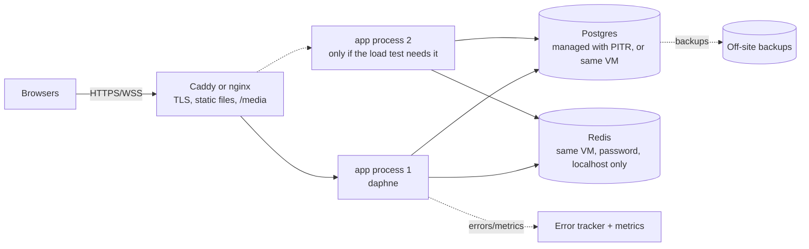
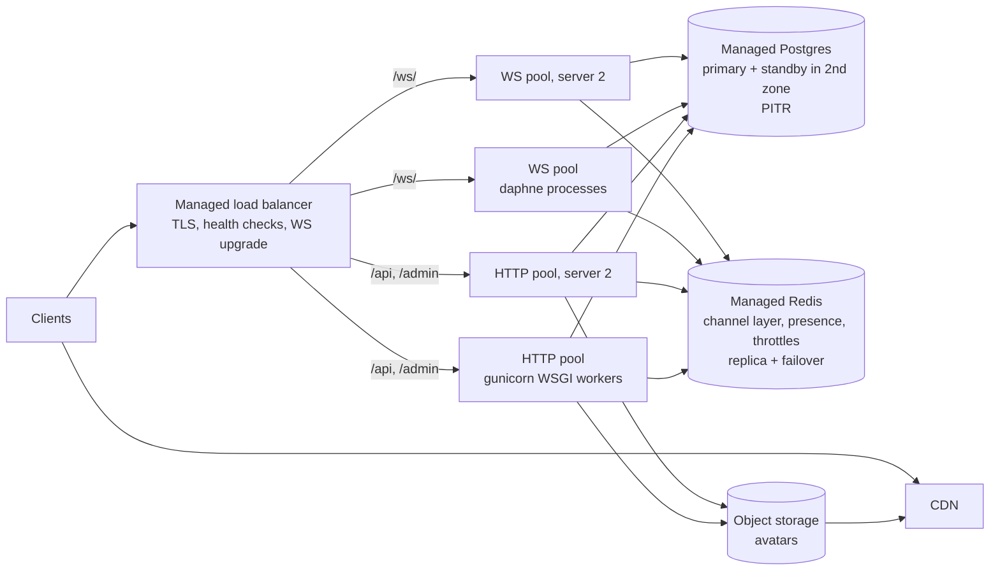

# 2. Baseline, capacity model and the scaling stages

**Target:** users **online at the same time** (open WebSocket), not registered users.

| Stage | Peak online at once | Status |
|---|---|---|
| Now | ~100 (measured, heavy profile) | Prototype |
| Stage 0 | — | Fix before any real user |
| Stage 1 | **1,000** | One server, efficient code |
| Stage 2 | **10,000** | Several servers, redundancy. **Final target.** |
| Beyond | 100,000+ | Out of scope (short note at the end) |

How to read this file:

- Sections 2.1–2.4 establish **what we know, what we assume, and how we measure**.
- Then one section per stage. Big decisions use the 12-step template (problem,
  mechanism, effect on this repo, scale, detection, options, choice, why not the others,
  trade-offs, implementation and verification, new problems, when to revisit) plus a
  short ADR. Smaller changes are kept brief.
- Task IDs (`T-xx`) refer to the backlog in [03-operations.md](03-operations.md#32-implementation-backlog).

---

## 2.1 Unknowns we must measure or decide

| Unknown | Why it matters | How to get it |
|---|---|---|
| Is the app deployed? Where? | Decides whether SEC-1 is an active breach or a pre-launch fix. | **Ask you.** |
| Messages per online user per minute | Main driver of DB writes. | Count `Message` inserts per minute ÷ sockets online (T-12). |
| Share of online users actively chatting | Most open tabs are idle; this sets the write load. | Same metrics (T-12). |
| Endpoint request rates, p95/p99 | Finds where time goes. | Request metrics middleware (T-12). |
| DB query latency, connections in use | Finds DB saturation. | `pg_stat_statements` + `pg_stat_activity` (T-12). |
| CPU, memory, sockets per process | Finds the process limit. | Host metrics + `run.py` soak test. |
| Data growth (rows/day, GB/month) | Storage cost, retention, backup time. | Daily table-size query (T-12). |
| Availability target, acceptable data loss | Decides HA and backups (RPO/RTO). | **Product decision.** Provisional values below. |
| Budget | Decides managed vs self-hosted. | **Ask you.** |
| Users' geography | Decides region. The code defaults to Uzbek numbers (`region="UZ"`). | Ask, then confirm with request geo once live. |

## 2.2 Workload model

### Definitions

- **Concurrent online users (C):** have a socket open *right now*. This is our target
  metric. Each costs an open socket, a ping every 30 s and a chat list poll every 45 s, even when idle.
- **Messages per second (M):** the expensive write path (PERF-3).
- **Requests per second (RPS):** HTTP requests + WebSocket frames.
- **Registered users:** only cost storage. Shown below for context only.
- **Peak vs average:** capacity must cover the busiest minute, not the daily average.

### Assumptions (provisional: replace with measurements)

| ID | Assumption | Value | Reasoning |
|---|---|---|---|
| A1 | Online users actively chatting at any moment | 20% | Most open tabs are idle. |
| A2 | Message rate while chatting | 4 per minute | Short back-and-forth texting. |
| A3 | Client behaviour | as `app.js` today | Ping 30 s, chat list poll 45 s, token refresh every 5 min. |

So **M = C × 0.2 × 4 / 60 ≈ C / 75**.

> Note: our trial load test used a much heavier profile (50% chatting at 10/min),
> about **6× more messages per user** than A1–A2. That's why "100 online" there is a
> pessimistic number.

### Load per stage

DB calls/s are computed for **today's code**: 7 per message, 1 per ping, about 1
connection per HTTP request.

| Stage | Peak online C | Messages/s | Pings/s | HTTP req/s | DB calls/s (today's code) | Registered users (context only, if ~2% are online at peak) |
|---|---|---|---|---|---|---|
| Now | 100 | 1.3 | 3.3 | 2.6 | ~15 | ~5,000 |
| 1 | 1,000 | 13 | 33 | 26 | ~150 | ~50,000 |
| 2 | 10,000 | 133 | 333 | 256 | ~1,500 | ~500,000 |

**Challenge this table.** If real users chat twice as much as A1–A2, the message
columns double. Replace A1–A2 with measured values as soon as you have them.

## 2.3 Capacity model: what actually limits this app

From the audit (PERF-1 to PERF-4):

- One process has **one thread** for all WebSocket database and Redis work.
- Each DB call on that thread costs **~6.5 ms** today (6.2 ms connect + 0.2 ms query).
- So one process tops out around **150 DB calls/s**, and latency explodes above ~70%
  of that: **~100 DB calls/s** is the practical ceiling.
- Measured: healthy at ~65 DB calls/s, failed at ~133.

| Stage | Needs (today's code) | One process today (~100/s) | Verdict |
|---|---|---|---|
| Now | ~15/s | 15% | Fine. Under the realistic A1–A2 profile, today's process might hold roughly **600 online**. That's an estimate: **measure it first** (T-12). |
| 1 | ~150/s | 150% | Over the limit. Needs the efficiency fixes (pooling, fewer calls per message), probably plus a second process. |
| 2 | ~1,500/s | 1,500% | Efficiency fixes **and** several processes on several servers, plus redundancy. |

**The key insight:** the limit is not "number of users". It's
`(DB calls per action) × (cost per call) ÷ (threads that can make calls)`. We attack
the factors in the cheapest order:

1. **Cost per call** (connection pooling: ~6.5 ms becomes well under 1 ms). Biggest win, lowest risk.
2. **Calls per action** (stop writing `last_seen` on every frame, async presence, query rewrites).
3. **Number of processes** (horizontal scaling). Adds operational complexity, so it comes last.

**After the stage 1 fixes**, the estimate per 10,000 online is roughly:
133 msg/s × ~5 calls + ~170 `last_seen` writes/s ≈ 830 calls/s on the WebSocket thread,
at well under 1 ms each. The DB thread then stops being the limit. The next one is likely
Python CPU (JSON, channel layer, 10,000 open sockets), which is why stage 2 runs several
processes. All of this is an estimate: the stress test decides.

## 2.4 How we measure (testing methodology)

The harness exists: `loadtest/run.py` + `manage.py loadtest_seed`. Extend it as you go (T-12).

| Test | Question it answers | How |
|---|---|---|
| **Load test** | Does the system meet the SLO at the expected peak? | `run.py --steps <peak>,<2×peak> --hold 300 --active 0.2 --msg-rate 4` |
| **Stress test** | Where does it break, and *what* breaks first? | Step up with `--keep-going` until failure; watch server metrics to name the bottleneck. |
| **Soak test** | Does it stay healthy for hours? | 4–8 h at 1× peak. Pass only if memory, connections and p95 stay **flat**. |
| **Reconnect storm** | What happens when a deploy drops every socket at once? | Connect N clients, restart the server, measure reconnect time and p95 during it. |
| **HTTP-only test** | Does REST concurrency exhaust Postgres connections (PERF-8)? | Many clients polling `/chats/` without sockets. |
| **Failure injection** | Do we degrade gracefully? | Stop Redis, restart Postgres, kill one app process, all during a load test. |
| **Abuse tests** | Do rate limits hold? | Scripted brute force, message flood, enumeration; expect 429s and stable p95 for normal users. |

Rules that keep measurements honest:

- Run the load generator on a **different machine** than the server.
- **10,000 sockets need several generator machines.** One machine can only open about
  28,000–60,000 connections to the same server address, and its CPU usually runs out
  earlier. Plan 2–4 generator machines for the stage 2 test (20,000 sockets).
- Seed **realistic data**, including "heavy" users with hundreds of chats, because
  PERF-5 only shows with history.
- Save every run (`--json`) with **commit hash + config**, so you can compare before and after.
- **"Passed" means:** SLO met at 2× expected peak, plus a soak at 1× peak with flat
  resource graphs. "Survived 60 seconds" is not passing.

### Provisional SLOs (assumptions to confirm with you)

| Metric | Stage 1 (1,000 online) | Stage 2 (10,000 online) |
|---|---|---|
| Message delivery p95 / p99 (send → echo on sender's socket) | ≤ 300 ms / ≤ 1 s | ≤ 300 ms / ≤ 1 s |
| REST p95 (chat list, history) | ≤ 300 ms | ≤ 300 ms |
| Error rate (5xx, lost messages, failed connects) | < 0.1% | < 0.1% |
| Availability (monthly) | 99.5% (~3.6 h down/month) | 99.9% (~43 min down/month) |
| RPO (max data loss) / RTO (max downtime) | 1 h / 2 h | 5 min / 30–60 min |

---

## Stage 0 · Before any real user

These are already wrong today, at any traffic level. Scaling an insecure or lossy system
only makes the damage bigger.

| Task | Fixes | Effort |
|---|---|---|
| T-01 Settings from environment; rotate `SECRET_KEY`; `DEBUG`/`ALLOWED_HOSTS` from env; pass `check --deploy` | SEC-1, SEC-2, OPS-7 | 2–4 h |
| T-02 `disconnect()` always marks offline (try/finally) | COR-2 | 1 h |
| T-03 Throttle login, register, refresh, public profile, chat create | SEC-3, SEC-4 | 3–6 h |
| T-04 Validate WebSocket input; max message length; per-socket rate limit | SEC-5, COR-3 | 3–5 h |
| T-05 Product decision on who can start a chat; enumeration-safe responses | SEC-4 | 1–3 h + decision |
| T-06 Avatar size/dimension limits; remove `media/` from git | SEC-6 | 1–2 h |
| T-07 Refresh rotation + blacklist; server-side logout | SEC-7 | 2–4 h |
| T-08 Complete, pinned requirements; pick psycopg 3; `pip-audit` | SEC-10, OPS-3 | 1–2 h |
| T-09 Client: reconnect jitter + "gap fetch" after reconnect | COR-1, COR-4, COR-5 | 4–8 h |
| T-11 Test suite + CI | OPS-1, OPS-2 | 1–2 days for the first useful set |

### Decision 0.1: Where secrets live (SEC-1). Concise template

1. **Problem:** the signing key for every login token is public.
2. **Mechanism:** JWTs are HMAC-signed with `SECRET_KEY`. Anyone with the key computes valid signatures.
3. **In this repo:** `root/settings.py:13`; SimpleJWT uses it by default.
4. **At scale:** severity doesn't depend on scale. It's total compromise at 10 users or 10,000.
5. **Detect:** `check --deploy` W009; secret scanners (`gitleaks`, GitHub secret scanning) in CI.
6. **Options:** (a) environment variable; (b) a secret manager (AWS Secrets Manager,
   Doppler, Vault) that injects env vars; (c) an encrypted file in the repo (sops).
7. **Choice:** (a) now, read via `os.environ['DJANGO_SECRET_KEY']`, failing loudly if missing.
8. **Why not (b)/(c) now:** (b) is right once you have several servers and people
   (stage 2); (c) adds key-management overhead you don't need yet.
9. **Trade-offs:** env vars can leak through crash dumps or `ps e`; acceptable at this size.
10. **Implement/verify:** generate with
    `python -c "import secrets; print(secrets.token_urlsafe(64))"`; settings refuse to
    start without it; a test asserts `DEBUG` is False when `DJANGO_ENV=production`;
    `check --deploy` clean in CI.
11. **New problems:** rotating logs everyone out; losing the key also logs everyone out
    (tokens are stateless, so no data is lost).
12. **Revisit:** when more than one person or server needs the secret, move to a secret manager.

### Decision 0.2: Rate limiting design (SEC-3, SEC-4, SEC-5)

1. **Problem:** nothing stops one client from doing an action 10,000 times a minute.
2. **Mechanism:** every request is served at full cost. Login is deliberately expensive
   (~200 ms CPU, measured), and writes are permanent.
3. **In this repo:** `/auth/login/`, `/auth/register/`, `/auth/token/refresh/`,
   `/users/<pk>/`, `POST /chats/` have no throttle; the WebSocket `receive()` has none either.
4. **At scale:** at low traffic, abuse is the *only* way to overload you; at high traffic,
   abuse hides inside normal load and costs real money (DB storage, egress).
5. **Detect:** 429 rates per endpoint; top-N callers by IP/user; login failure rate.
6. **Options:**
   - (a) **DRF throttles** backed by the existing Redis cache. Per-IP for anonymous
     endpoints, per-user for authenticated ones, plus a per-phone-number limit on login.
   - (b) Reverse-proxy limits (nginx `limit_req`) per IP.
   - (c) An edge WAF/CDN (Cloudflare etc.) with bot management.
   - (d) For WebSocket messages: an in-memory **token bucket per socket**.
7. **Choice:** (a) + (d) now. Add (b) when nginx arrives (stage 1). Add (c) at stage 2 or under attack.
8. **Why not only (b)/(c):** they only see IPs and URLs. They can't express "5 failed
   logins *per phone number*" or "30 messages/min *per user*". Business rules belong in the app.
9. **Trade-offs:**
   - Per-IP limits punish users behind shared NAT (mobile carriers and offices share IPs),
     so keep IP limits generous and account limits strict.
   - Throttle state lives in Redis, so a Redis outage must not take login down (fail open, T-21).
10. **Implement/verify:**
    - Settings sketch:
      ```python
      'DEFAULT_THROTTLE_RATES': {
          'user_lookup': '20/hour',
          'login_ip': '20/min', 'login_phone': '5/min',
          'register_ip': '5/hour', 'refresh': '30/min',
          'profile_read': '120/min', 'chat_create': '30/hour',
      }
      ```
    - `login_phone` needs a small custom throttle whose cache key is the normalised phone
      number from the request body.
    - Behind a proxy, DRF's IP detection must use `NUM_PROXIES`, or every client looks
      like the proxy's IP. That's a classic production bug.
    - Tests: the 6th login for one phone in a minute returns 429; other phones are unaffected.
11. **New problems:** an attacker can lock a victim out by hammering their phone number.
    Mitigate with short windows (minutes, not hours), and later CAPTCHA/OTP instead of a hard block.
12. **Revisit:** when attacks come from many IPs (add the WAF).

**Per-socket message limit (T-04), worked example.** A token bucket holds up to `burst`
tokens and refills at `rate` tokens per second. Each message spends one token; with no
token, the message is rejected. That allows short bursts and caps the sustained rate.

```python
import time

class TokenBucket:
    def __init__(self, rate: float, burst: int):
        self.rate, self.burst = rate, burst
        self.tokens, self.updated = float(burst), time.monotonic()

    def take(self) -> bool:
        now = time.monotonic()
        # Refill for the time that passed, never above the bucket size.
        self.tokens = min(self.burst, self.tokens + (now - self.updated) * self.rate)
        self.updated = now
        if self.tokens >= 1:
            self.tokens -= 1
            return True
        return False
```

- In `InboxConsumer.connect`: `self.bucket = TokenBucket(rate=1, burst=10)`
  (10 quick messages, then 1/s).
- In `receive()`: reject with `send_error('Slow down.')` when `take()` is False.
- `take()` is O(1) time and memory, and needs no lock because one consumer handles its
  frames one at a time.
- **Limitation:** a user with 5 tabs gets 5 buckets. Cap sockets per user at connect
  (`SCARD presence:<id>` ≤ 5); per-*user* limits across processes need Redis (stage 2, T-26).

**Input validation in the same task:** check `isinstance(payload, dict)`, `isinstance(text, str)`,
`len(text) <= 4000` (pick the number with the product owner), and add the same
`max_length` to `MessageSerializer` so the REST path matches.

### Decision 0.3: Making live delivery recoverable (COR-1, COR-4). The most important correctness fix

1. **Problem:** messages that arrive while you're reconnecting never appear in the open chat.
2. **Mechanism:** the Redis channel layer is a *notification* system: at-most-once,
   no replay. Postgres is the *source of truth*. The client treats the notification
   stream as complete, but it isn't.
3. **In this repo:** `ws.onopen` (`app.js:387`) doesn't reload; `channels_redis`
   drops after 60 s or 100 queued messages.
4. **At scale:** every deploy disconnects every user. At 10,000 online, one deploy means
   10,000 reconnects. Without a gap fetch, some messages "disappear" every deploy;
   without jitter, the reconnects arrive in synchronised waves.
5. **Detect:** test (disconnect → send → reconnect → assert visible); in production,
   count history fetches triggered by gaps.
6. **Options:**
   - (a) **Gap fetch:** after reconnect, ask the API for messages newer than the last one the client has.
   - (b) Durable per-user queue (Redis Streams / Kafka) with acknowledgements, replayed on reconnect.
   - (c) Sequence numbers per chat so the client can detect gaps on every message.
7. **Choice:** (a) now, using the existing `Message.id` as the cursor; keep (c) in mind for later.
8. **Why not (b):** it duplicates what Postgres already guarantees, and adds a
   stateful system to operate, size and back up. Our source of truth can answer
   "what did I miss?" with one indexed query.
9. **Trade-offs:** one extra API call per reconnect (cheap and indexed). Messages can
   arrive twice (socket + fetch); the client already de-duplicates by id (`state.seenIds`).
10. **Implement/verify:**
    - Server: `GET /chats/<id>/messages/?after=<id>` filters `id > after`, ascending, limit 200.
    - Client: in `onopen`, if a chat is open, fetch `after=<largest id shown>`, then `loadChats()`.
    - Jitter: `delay = Math.random() * Math.min(15000, 1000 * 2 ** retry)`
      ("full jitter", which spreads reconnects evenly instead of in waves).
    - Test with `WebsocketCommunicator` + API client: send 3 messages while B is
      disconnected; B reconnects and fetches; assert 3 messages, no duplicates.
    - The same test confirms or refutes COR-5 (the 4401 code).
11. **New problems:** a reconnect storm becomes a storm of history fetches. That's why
    jitter ships in the same change, and why the endpoint must be indexed and limited.
12. **Revisit:** for mobile push or multi-device sync with per-device read state, move to
    per-chat sequence numbers (c).

**This decision is what makes every later step safe.** Rolling deploys, Redis failovers
and process crashes all drop live notifications; with gap fetch, none of them loses a
message from the user's point of view.

### Stage 0 exit criteria

- `manage.py check --deploy` passes with production settings; `gitleaks` clean; new `SECRET_KEY` in use.
- Tests run in CI for: auth throttles (429), message length and rate limits,
  enumeration limits, disconnect marks offline, gap fetch after reconnect, membership
  access control (user C can't read A↔B's messages via REST or WebSocket).
- `pip-audit` clean or exceptions documented.
- **Baseline measured:** `run.py` with the realistic profile (`--active 0.2 --msg-rate 4`)
  from a second machine, so you know today's real ceiling before changing anything.

---

## Stage 1 · 100 → 1,000 online users

**Model:** 1,000 online, ~13 messages/s, ~33 pings/s, ~26 HTTP req/s, ~150 DB calls/s
with today's code. That's above one process's measured ceiling (~100/s). So this stage
needs **both** the launch basics (deploy, backups, monitoring) **and** the efficiency fixes.

### Milestone reasoning

1. **New risks:** real people and real data (data loss, breach, being blind to errors),
   plus latency collapse at peak because the DB thread saturates.
2. **Likely bottleneck:** the WebSocket DB thread (PERF-1 × PERF-2). Second: the chat
   list query, which grows with history (PERF-5).
3. **Present vs future:** stage 0 issues and the per-call cost are present today;
   saturation arrives somewhere between ~600 and 1,000 online (estimate, to measure).
4. **Fix now:** deploy properly, backups with a restore drill, error tracking and metrics;
   then pooling, fewer calls per message, the chat list query, cursor pagination.
5. **Leave unchanged on purpose:** one server, one database, no cache layer, no read
   replica, no queue, no load balancer.
6. **What justifies more:** after the fixes, if the load test at 2,000 online misses the
   SLO, add a second process on the same server (T-22). A second *server* waits for stage 2.
7. **Improvement to measure:** DB time per message; the new healthy ceiling per process.
8. **Validate:** the **same** load test before and after each change.
9. **Next bottleneck:** Python CPU per process, and the single server as a point of failure.
10. **Why this fits:** it removes waste instead of adding machines. It costs hours, not monthly bills.

### A. Target architecture



- **Unchanged:** the Django app, Channels, Redis roles, Postgres schema (plus one index).
- **Added:** a reverse proxy (TLS, static, media, body limits, logs without query
  strings), a process manager, backups, error tracking, metrics, health endpoints,
  a connection pool.
- **Tolerates:** an app crash (auto-restart in seconds; clients reconnect with jitter and
  gap fetch). **Doesn't tolerate:** losing the VM. Accepted at this stage: restore within the RTO.
- **Postponed:** load balancer, second server, object storage, CDN, background jobs.

### B. Code-level changes, part 1: launch basics

| Change | Detail |
|---|---|
| Health endpoints (T-12) | `/healthz` (process alive: return 200, touch nothing) and `/readyz` (`SELECT 1` + Redis `PING`, 1 s timeouts). Liveness must not check dependencies, or a Postgres blip makes the supervisor restart healthy processes, which makes things worse. |
| Logging (T-12) | JSON lines to stdout: request id, user id, path, status, duration. **Never log** tokens, passwords, message text or phone numbers. |
| Error tracking (T-12) | Sentry SDK (or similar) with `send_default_pii=False` and a scrubber for `token` query params. |
| Metrics (T-12) | See the table in G below. Add `pg_stat_statements`. |
| Production settings (T-01) | `SECURE_PROXY_SSL_HEADER`, `CSRF_TRUSTED_ORIGINS`, HSTS, secure cookies. |
| Static (T-10) | `collectstatic` at build; the proxy serves `/static/`. |

### Decision 1.1: Managed vs self-hosted Postgres

1. **Problem:** the database holds everything; losing it loses the product.
2. **Mechanism:** disks fail, people run the wrong command, VMs get deleted.
3. **In this repo:** Postgres is a local Docker container with no backups.
4. **At scale:** at stage 1, data loss is the main risk. At stage 2, failover matters as much.
5. **Detect:** restore drills; backup job alerts; disk usage alerts.
6. **Options:**
   - (a) Managed Postgres (AWS RDS, DigitalOcean, Neon, Supabase, etc.).
   - (b) Postgres on the same VM as the app.
   - (c) Postgres on its own VM.
7. **Choice:** (a) with point-in-time recovery if the budget allows (usually the best
   use of money at this stage); otherwise (b) with nightly backups and a restore drill.
8. **Why not (c):** all the work of self-hosting, plus a second machine, without the
   automated backups/failover of (a).
9. **Trade-offs:** (a) costs more per GB/CPU. (b) is cheapest but makes you the DBA, and
   app and DB compete for the same CPU/RAM.
10. **Implement/verify:** connect over TLS (`sslmode=require`); restore drill; **re-measure
    connect latency**. Over a network it will be higher than 6 ms, which makes pooling (1.2) even more important.
11. **New problems:** network latency between app and DB adds to every call. Keep them in the **same region/zone**.
12. **Revisit:** at stage 2 (standby in a second zone).

### Decision 1.2: Connection pooling (PERF-2). Full template

1. **Problem:** every database call first opens a brand-new connection, ~28× slower than the query itself.
2. **Mechanism:** a Postgres connection needs TCP setup, authentication (SCRAM) and a new
   server process. Django with `CONN_MAX_AGE=0` throws it away after each request;
   `database_sync_to_async` does it after every call.
3. **In this repo:** measured 6.2 ms connect vs 0.22 ms query. On the single WebSocket
   thread (PERF-1), that 6 ms is pure waiting time for every other socket.
4. **At scale:**
   - Low traffic: invisible.
   - Moderate: the WS thread fills up (≈ 85% busy at 133 calls/s), and p95 explodes.
   - High: Postgres burns CPU creating processes; HTTP concurrency also exhausts `max_connections` (PERF-8).
   - The failure is **sudden**: latency is flat until ~70% busy, then shoots up.
5. **Detect:** connection rate in Postgres (`log_connections=on`); time spent in
   `connect()` in tracing; the load test's p95 vs DB calls/s curve.
6. **Options:**
   - (a) `CONN_MAX_AGE = 60` (persistent connection per thread).
   - (b) **Django's built-in psycopg 3 pool** (`OPTIONS: {"pool": {...}}`, Django ≥ 5.1).
   - (c) **PgBouncer**, an external pooler between app and DB.
   - (d) Simply raising Postgres `max_connections`.
7. **Choice:** (b).
8. **Why not the alternatives:**
   - (a) Django's docs advise against persistent connections under ASGI: each HTTP request
     runs on a new thread, so per-thread connections pile up instead of being reused.
   - (c) Right once **many processes** each hold pools and their sum approaches
     `max_connections` (stage 2, on trigger). Now it's an extra service to run.
   - (d) Doesn't remove the 6 ms connect cost. Each Postgres connection is a process using
     several MB of RAM, and too many active ones make an overloaded database *slower*.
9. **Trade-offs:**
   - A bounded pool means requests may **wait** for a connection. That's deliberate: a
     queue in the app is better than an overloaded database.
   - Each process holds `min_size` idle connections even when quiet.
10. **Implement/verify:**
    ```bash
    pip install "psycopg[binary,pool]"   # and drop psycopg2-binary (T-08)
    ```
    ```python
    DATABASES['default']['OPTIONS'] = {
        'pool': {'min_size': 2, 'max_size': 10, 'timeout': 5},
    }
    # CONN_MAX_AGE must stay 0 with the pool; close_old_connections() now
    # returns the connection to the pool instead of closing it.
    ```
    - **Sizing with Little's law:** connections busy = throughput × time each is held.
      At 300 calls/s × 1 ms ≈ 0.3 connections busy on average. `max_size` exists for bursts
      and slow queries. Total across processes must stay below `max_connections` minus a
      reserve for admin/migrations (~10).
    - `timeout: 5`: if no connection frees up within 5 s, fail fast (503) instead of piling up.
    - **Verify:** the same load test before and after. Expect DB time per call to drop from
      ~6.5 ms to well under 1 ms. Write down the measured number; don't predict it.
11. **New problems:**
    - A pooled connection can be **broken** after a DB restart (verify with failure injection).
    - `PoolTimeout` errors become a new alert.
12. **Revisit:** when `processes × max_size` exceeds roughly 60–70% of `max_connections`: add PgBouncer (T-32).

**ADR-1.2**
- **Context:** WS hot path pays 6.2 ms connect per 0.2 ms query on one thread.
- **Constraints:** ASGI; Postgres `max_connections` 100; one developer.
- **Options:** CONN_MAX_AGE / Django psycopg pool / PgBouncer / raise max_connections.
- **Decision:** Django psycopg pool, `max_size` 10 per process.
- **Rationale:** biggest latency win per line of code; no new service.
- **Trade-offs:** bounded waits under burst; idle connections held.
- **Consequences:** switch driver to psycopg 3; new `PoolTimeout` metric/alert.
- **Reconsider when:** total pool size approaches 60–70% of `max_connections`.

### Decision 1.3: Fewer calls per message before more processes (PERF-3, PERF-1)

"Make each process do less" vs "add more processes":

- Adding processes multiplies capacity but also multiplies DB connections, memory and
  deploy complexity.
- Removing waste is free capacity with *less* load on Postgres.
- So: remove waste first, measure, then scale out.

| Change | Now | After | Calls saved per message |
|---|---|---|---|
| **T-15** `touch_last_seen` at most once per 60 s per socket (same rule as `LastSeenJWTAuthentication`) | every frame (`consumers.py:82`) | `if monotonic() - self._touched > 60` | 2 (sender + reader), and 1 per ping |
| **T-16** Async presence (`redis.asyncio`) | sync Redis via `sync_to_async` on the DB thread (`consumers.py:65,72,86`) | awaited directly on the event loop | removes Redis from the DB thread entirely |
| **T-29** Remember chat membership on the socket | `get_chat` SELECT per frame | cache `{chat_id: (user1_id, user2_id)}` per socket | 1–2 |

- **T-29 is optional; measure first.** After pooling, `get_chat` costs ~0.3 ms. Caching it
  adds an invalidation question (a chat created after connect isn't cached, so fall back
  to the DB on a miss). Only do it if profiling shows it matters. A good example of
  *not* adding a cache by reflex.
- **T-15 detail:** keep the unconditional write in `disconnect()`, so "last seen" is
  exact when the user leaves. Nobody sees `last_seen` while online anyway (the UI shows "online").

### Decision 1.4: Chat list query (PERF-5): index vs rewrite vs cache vs denormalise

1. **Problem:** the chat list is the most expensive request, and every online user polls it every 45 s.
2. **Mechanism:**
   - (i) unread count via `LEFT JOIN` over all messages + `GROUP BY` (reads every message the user ever had);
   - (ii) the pagination `COUNT(*)` re-runs the whole aggregate;
   - (iii) sorting by a computed value prevents an early `LIMIT`;
   - (iv) loading password hashes.
3. **In this repo:** `chats/views.py:33-47`; measured: aggregate runs twice; `EXPLAIN` shows the join.
4. **At scale:**
   - Cost per request ∝ total messages in the user's chats. 50 chats × 2,000 messages = 100k rows read per poll.
   - Request rate ∝ online users: 1,000 online = 22 of these per second.
   - Gradual failure: it gets worse every week as history grows, even with flat traffic.
5. **Detect:** `pg_stat_statements` time for this query; endpoint p95 vs the user's
   message count; a seeded "heavy user" in load tests.
6. **Options:**
   - (a) **Rewrite + partial index:** unread as a correlated `Subquery` counting only unread
     messages via a partial index `(chat_id) WHERE NOT is_read`. That also lets `COUNT(*)`
     drop the annotations. `.only()` the needed user columns.
   - (b) Cache the chat list per user in Redis for N seconds.
   - (c) Denormalise into a per-member inbox table (stage 2, Decision 2.3).
   - (d) Stop polling the chat list for presence (stage 2, Decision 2.2).
7. **Choice:** (a) now; (c) and (d) in stage 2 if metrics justify them.
8. **Why not (b):** the chat list changes on every message (preview, order, unread), so
   the cache needs invalidating on every message for both people. Stale data is visible
   (a wrong unread badge). Fixing the query removes the cost instead of hiding it.
9. **Trade-offs:** (a) adds one small index, cheap because it only holds unread rows.
10. **Implement/verify:**
    ```python
    unread = (Message.objects
              .filter(chat=OuterRef('pk'), is_read=False)
              .exclude(sender=me)
              .order_by()
              .values('chat')
              .annotate(n=Count('*'))
              .values('n'))
    qs = (chats_for(me)
          .annotate(last_message_text=..., last_message_at=...,  # unchanged
                    unread_count=Coalesce(Subquery(unread), 0))
          .only('id', 'created_at', 'user1_id', 'user2_id',
                'user1__id', 'user1__first_name', 'user1__avatar', 'user1__last_seen',
                'user2__id', 'user2__first_name', 'user2__avatar', 'user2__last_seen'))
    ```
    ```python
    # chats/models.py, Message.Meta.indexes
    Index(fields=['chat'], condition=Q(is_read=False), name='message_unread_by_chat'),
    ```
    - **Verify:**
      - A `CaptureQueriesContext` test asserts the count query no longer has `GROUP BY`.
        Django strips unused non-aggregate annotations from `count()`; confirm this on
        Django 6.1 with the test.
      - `EXPLAIN (ANALYZE, BUFFERS)` on a heavy user, before vs after.
      - `unread_count` identical to the old query on seeded data.
11. **New problems:** correlated subqueries run once per chat, which is fine for hundreds
    of chats per user. Build the index with `AddIndexConcurrently` (`atomic = False`) so writes aren't locked.
12. **Revisit:** if chat-list p95 exceeds the SLO for heavy users, go to (c).

### B. Code-level changes, part 2: other stage 1 items

- **T-18 Cursor pagination for message history** (PERF-6, COR-6). Offset pagination is
  `O(offset)` and needs `COUNT(*)`. A cursor ("50 messages older than id X") is an index
  seek, `O(log n)`, at any depth, and stable when new messages arrive.
  - Use DRF `CursorPagination` with `ordering = '-id'`.
  - **Compatibility:** `app.js` uses `?page=` (`loadHistory`). Open tabs keep the old JS
    until they reload, so for one release accept both (expand), switch the client to
    `next` links, then remove `?page=` (contract).
- **T-19 Drop redundant indexes** (PERF-7) with `RemoveIndexConcurrently`. Lowest priority.
- **T-22 Second app process, only if needed:** two Daphne processes on different ports;
  the proxy balances between them. This works because cross-process delivery already goes
  through the Redis channel layer. **Test it:** user A on process 1, user B on process 2, messages flow both ways.

### C. Database

- Pooling (T-13), chat list rewrite + partial index (T-17), cursor pagination (T-18).
- `pg_stat_statements` on (T-12). It's the single most useful database tool you'll learn.
- **Backups (T-14):** managed PITR, or nightly `pg_dump -Fc` off-site kept 14 days, plus a
  **monthly restore drill**. *A backup you've never restored is a hope, not a backup.*
- **Migration safety from now on:** indexes on `chats_message` built `CONCURRENTLY`; never
  a volatile default on a big table in one step (03-operations §3.4).
- **Data growth:** ~13 messages/s at peak, maybe ~4/s on average, ≈ 350k messages/day.
  Small for Postgres, but start measuring table size weekly.

### D. Infrastructure and deployment

- **Process:** `daphne -b 127.0.0.1 -p 8000 root.asgi:application` under systemd (or Docker
  with `restart: unless-stopped`). Not `runserver`: it's a dev server.
- **Proxy:** Caddy (automatic TLS) or nginx + certbot. Pass WebSocket upgrades, set read
  timeouts above the 30 s ping (for example 75 s), cap the body (for example 3 MB), log
  without query strings (SEC-8).
- **Server size:** one VM; scale it **up** first (more CPU/RAM) if needed. Vertical scaling
  needs no code change.
- **File descriptors:** each socket is an open file. Raise the process limit
  (`LimitNOFILE=65536` in systemd).
- **Redis:** localhost or private network, `requirepass`, never a public port (SEC-9).
- **Deploy:** tag the release, run `migrate`, restart. Clients reconnect within seconds
  (jitter + gap fetch). **Rollback:** redeploy the previous tag (safe with expand-only migrations).
- **CI/CD (T-11):** tests + `check --deploy` + `pip-audit` + `makemigrations --check` on every push.

### E. Security

All stage 0 items, plus: TLS everywhere, HSTS, firewall (only 80/443 open, SSH by key),
automatic OS security updates, Dependabot. Review rate limits against real traffic; alert
on 429 spikes and login failure rates.

### F. Concurrency

- Verify existing guarantees with tests: concurrent `POST /chats/` for the same pair produces one chat.
- If T-22 adds a second process: run the reconnect storm test with both processes.

### G. Observability

| Metric | What / why | Investigate when | Action |
|---|---|---|---|
| Error events (Sentry) | Bugs users hit | Any new error type | Fix or ticket within a day |
| `/readyz` external uptime check | Is it up for users? | 2 consecutive failures | Check process, DB, Redis |
| `ws_connections` per process | Load, leaks | Doesn't return to baseline after peak | Check the disconnect path (COR-2) |
| `message_delivery_seconds` p95/p99 | The core SLO | p95 > 300 ms for 5 min | DB thread saturation, pool waits |
| `db_pool_wait_seconds`, `PoolTimeout` count | Pool too small or DB slow | Waits > 50 ms p95 | Slow queries first, then size |
| Postgres: connections, top queries by total time | DB health | Connections > 70% of max | Pool sizing; query fixes |
| Redis memory | Channel layer health | Growth across days | Group expiry / disconnect bugs |
| Disk usage (DB + media), backup success, TLS expiry | Classic silent outages | Disk > 70%; any backup failure; cert < 14 days | Resize; re-run; check renewal |

**Incident drill:** "the server is gone". Restore the DB onto a new VM, deploy, and time it against the RTO.

### H. Cost

One VM (2–4 vCPU), managed Postgres with PITR (or none, if self-hosted), error tracker
free tier, backup storage. Almost all fixed monthly cost. Method in 03-operations §3.5.

### Stage 1 exit criteria

- Deployed behind TLS; `check --deploy` clean.
- Load test at **2,000 online** (2× peak), realistic profile, from a separate machine:
  message p95 ≤ 300 ms, p99 ≤ 1 s, error rate < 0.1%.
- Reconnect storm: restart with 2,000 online, everyone back within 60 s, zero missing messages.
- 4-hour soak at 1,000 online: memory, DB connections and Redis memory flat.
- Before/after numbers recorded for T-13, T-15, T-16, T-17, T-18.
- Restore drill done and timed within the RTO.

---

## Stage 2 · 1,000 → 10,000 online users (final target)

**Model:** 10,000 online, ~133 messages/s, ~333 pings/s, ~256 HTTP req/s. Two things change:

- **Availability** becomes as important as capacity. With 10,000 people online, one VM is
  an unacceptable single point of failure (99.9% target = 43 min/month).
- **10,000 open sockets** need several processes for CPU and memory, even with efficient code.

### Milestone reasoning

1. **New risks:** a server outage hits thousands at once; deploys must not visibly
   disrupt; the message table reaches hundreds of millions of rows within a year;
   abuse becomes organised (spam accounts).
2. **Likely bottlenecks:** CPU per process (sockets, JSON, channel layer), the chat list
   poll rate (220/s), `mark_read` updating many rows, total DB connections.
3. **Present vs future:** single points of failure are present at the start of this
   stage; table size and connection counts arrive during it.
4. **Fix now:** 2+ app servers behind a load balancer, managed DB with standby, managed
   Redis, object storage for media, an HTTP/WS process split, presence without the chat
   list poll, graceful deploys, per-user rate limits.
5. **Leave unchanged:** one database primary, one Django codebase, no microservices, no
   Kubernetes, no sharding, single region.
6. **Triggers for more:** see "Only when the trigger fires" below.
7. **Improvement to measure:** availability during a server kill; p95 during a rolling deploy.
8. **Validate:** failure-injection tests under load (kill a server, fail over the DB, restart Redis).
9. **Next bottleneck:** DB connections (processes × pools), then message table maintenance.
10. **Why this fits:** redundancy where outages hurt, one codebase and one database.
    Under our assumptions, ~133 writes/s is far below what one well-sized Postgres handles.

### A. Target architecture



- **Unchanged:** the Django monolith, the core data model, Channels/Redis as the real-time backbone.
- **Changed:**
  - HTTP and WebSocket run as **separate process pools**, so a reconnect storm can't
    starve the REST API and vice versa, and each scales on its own metric.
  - Media moves to object storage (needed as soon as there are 2 servers).
  - Managed Redis and Postgres with failover.
- **Tolerates:**
  - Losing one app server (LB health checks remove it).
  - DB primary failure (automatic failover, ~1–2 min of errors, then clients reconnect + gap fetch).
  - Redis failover (in-flight notifications lost and recovered by gap fetch; presence rebuilt within one ping).
- **Doesn't tolerate:** losing a whole region. Accepted unless a requirement says otherwise.
- **How many servers?** Decided by the stress test: find sockets per WS process at the SLO,
  divide 20,000 (2× peak) by it, and add one server so you survive losing one. Don't guess.

### Decision 2.1: Separate HTTP and WebSocket processes

- **Context:** under ASGI, one process serves both. HTTP requests each get a thread; WebSocket
  DB work shares one thread (PERF-1). The load shapes differ: short requests vs long-lived connections.
- **Options:**
  - (a) Keep one ASGI process type, just more of them.
  - (b) **WSGI (gunicorn, sync workers) for HTTP + ASGI for `/ws/` only**, routed by the LB.
  - (c) Rewrite views as async.
- **Decision:** (b).
- **Rationale:**
  - Gunicorn sync workers are the most battle-tested way to run DRF.
  - Each worker is an OS process, which bounds concurrency (and DB connections) explicitly.
  - The WS tier scales by socket count, the HTTP tier by request rate.
  - `root/wsgi.py` already exists; `broadcast_message()` already works from sync code (`async_to_sync`).
- **Why not (c):** DRF's async support is limited, and Django's async ORM still runs
  queries in threads. A rewrite with little gain.
- **Trade-offs:** two process types to deploy and monitor; LB path routing.
- **Reconsider when:** measurements show sockets per process are CPU-limited by the sync-to-async hops.

### Decision 2.2: Presence without polling the chat list (PERF-5 follow-up)

- **Today:** the 45 s poll exists only to refresh online dots (comment at `app.js:542`),
  but it re-runs the heaviest query. At 10,000 online that's ~220 heavy queries/s for presence alone.
- **Options:**
  - (a) Push presence changes over the socket to everyone who has a chat with the user.
  - (b) **A cheap `GET /presence/?ids=1,2,3` endpoint that only reads Redis** (one pipeline, no DB), polled every 45 s.
  - (c) Keep polling the chat list.
- **Decision:** (b) (T-24).
- **Why not (a):** each online/offline change fans out to all of a user's contacts.
  Someone with 500 chats on a flaky mobile connection generates 500 events per flap.
  Push is nicer UX but has unbounded fan-out. Revisit when the product wants real-time
  presence and you've measured contacts per user.
- **Effect:** the heavy chat list query drops from "every 45 s per online user" to "on open and on new-chat events".

### Decision 2.3: Inbox data model (only if metrics show the chat list still dominates)

1. **Problem:** even rewritten, the chat list computes "last message" and "unread" per chat at
   read time, and sorts by a computed value.
2. **Mechanism:** read-time work is O(chats per user) per request. `mark_read` updates one row
   per unread message (`chats/consumers.py:169`): write amplification.
3. **The option, concretely:** a `ChatMember` table (two rows per chat) with `user`, `chat`,
   `last_message_at`, `last_read_message_id`.
   - Chat list: `ChatMember.objects.filter(user=me).order_by('-last_message_at')[:50]` with
     an index on `(user_id, last_message_at DESC)`: an index scan returning exactly 50 rows.
   - Unread = messages in the chat with `id > last_read_message_id` from the other user
     (index `(chat_id, id)`, touches only unread rows).
   - Mark read = **one** row update instead of N message updates.
   - Read receipts (✓✓) = `message.id <= other_member.last_read_message_id`, so
     `Message.is_read/read_at` can eventually go.
4. **Trade-offs:** each new message also updates two `ChatMember` rows in the same
   transaction. A small write cost; fine for two-person chats.
5. **Migration (expand → migrate → contract), the template for every big change:**
   1. **Expand:** add `ChatMember` (new table, no locks on existing ones). Deploy.
   2. **Dual-write:** message insert updates `ChatMember` in the same transaction; mark-read
      writes both the old flags and the new pointer. Deploy.
   3. **Backfill** in batches of ~1,000 chats, throttled, resumable (store the last chat id done).
   4. **Verify:** a script compares old and new unread counts for a sample and all heavy users. Must be 100% equal.
   5. **Switch reads** behind a feature flag (5% of users first; compare metrics and errors).
   6. **Contract:** stop writing old columns; a release later, drop them.
   - **Rollback:** until step 6, flip the flag. **After dropping columns, rollback = restore
     from backup**, so wait at least a week before contracting.
   - **Partial failure:** if the backfill dies halfway, restart from the checkpoint (updates are idempotent).

### B. Code-level changes

| Task | Change |
|---|---|
| T-21 | Redis failure behaviour: throttles fail open; `/readyz` reports Redis. |
| T-23 | Gunicorn HTTP pool + Daphne WS pool + LB path routing. |
| T-24 | `/presence/` endpoint + client change. |
| T-25 | `ChatMember` (only with evidence). |
| T-26 | Per-user message rate limit across processes (Redis sliding window). |
| T-27 | Graceful WS shutdown on deploy: stop accepting, close sockets with code 1012 ("service restart") in batches, so clients reconnect spread out. |
| T-28 | Background job runner, only once a slow or external operation exists. |
| T-31 | Object storage for avatars (`django-storages`) + CDN. |

#### Decision 2.4: Background jobs: when and which

- **Today there are no background jobs, and that's fine:** everything the app does is fast.
  Don't add a queue "because scalable apps have queues".
- **Evidence that justifies one:** an operation that is slow, can fail and retry, or calls an
  external service: avatar resizing, account export/erasure, SMS/OTP, mobile push.
- **Options:**
  - (a) Celery + Redis broker (most common, more moving parts).
  - (b) RQ/Dramatiq (simpler).
  - (c) Django's built-in Tasks framework (`django.tasks`, added in Django 6.0) with a
    database-backed worker. Verify the backend options for 6.1 before choosing.
- **The principle whichever you pick:** queues deliver **at least once**, so a job can run
  twice. Make every job **idempotent** (for example "resize the avatar *if the thumbnail
  doesn't exist*", or a processed-job-id table with a unique constraint).

### C. Database

- Managed Postgres with a **standby in another zone** and automatic failover; PITR (RPO ≈ 5 min).
  Rehearse a failover under load: expect ~30–120 s of errors, then recovery.
- **Connections:** count `processes × pool max_size` across all servers. For example, 3
  servers × (8 gunicorn workers + 4 WS processes × 5) = 84, already close to 100. So size
  pools small (Little's law) and add PgBouncer when the trigger fires.
- **Data growth:** ~133 messages/s peak, maybe ~45/s average, ≈ 4M messages/day, ≈ 1.4B/year.
  - Agree a **retention policy** with the product owner early. It's far easier to decide before the data exists.
  - Track table + index size, autovacuum duration and backup/restore time monthly; they
    are the triggers for partitioning.
- `statement_timeout` (for example 5 s for the web role) so one bad query can't hold connections forever.

### Only when the trigger fires (evidence before complexity)

| Change | Trigger (measure, don't guess) | What it solves | New failure modes |
|---|---|---|---|
| **PgBouncer** (transaction pooling), T-32 | Σ(processes × pool) > ~60–70% of `max_connections` | Many client connections multiplexed onto ~50–100 server connections | Transaction mode breaks session features: set `DISABLE_SERVER_SIDE_CURSORS = True`; psycopg 3 auto-prepares statements, so use PgBouncer ≥ 1.21 with `max_prepared_statements` or set `prepare_threshold: None`. One more hop to keep highly available. |
| **Retention + monthly partitioning** of `chats_message`, T-33 | Vacuum, index builds or restores too slow; or retention needs cheap deletes (`DROP PARTITION` vs deleting millions of rows) | Maintenance stays per-month-sized | PK must include the partition key (Django ≥ 5.2 has `CompositePrimaryKey`); FKs *to* messages get complicated (store `last_read_message_id` as a plain integer); queries without a time bound hit all partitions; Django has no native partition management (raw SQL or `pg_partman`). **High-risk migration: rehearse on a staging copy.** |
| **Read replica**, T-34 | Primary CPU > ~60% at peak **and** reads dominate in `pg_stat_statements` after query work | Offloads reads | **Replica lag:** a user's just-sent message may be missing from a history read. Send read-your-writes (gap fetch, recent history) to the primary; only old pages to the replica. |
| **WS autoscaling; channel layer sharding**, T-35 | Sockets per process near the stress-test limit; Redis CPU > ~60% (Redis runs commands on one thread) | Daily peaks without paying for peak all day; spreads Redis load | Scale-in kills sockets (scale in slowly with T-27); losing one Redis shard drops some notifications (gap fetch recovers). |
| **CDN/WAF at the edge** | Attack traffic or avatar egress cost | Absorbs floods and bots | Never cache `/api/` responses. |

### D. Infrastructure and deployment

- **Load balancer:** managed (cloud LB) or an HAProxy pair. Health check `/readyz`. Idle
  timeout above the 30 s ping, for example 120 s.
- **Zero-downtime deploys:** rolling, one server at a time; drain HTTP; close WebSockets
  gradually (T-27). Gap fetch makes the WS side safe.
- **Infrastructure as code** (Terraform or the provider's equivalent): with 5+ resources,
  clicking in a console becomes unreproducible.
- **Containers:** yes (the same Docker image in CI, staging and prod). Orchestration: the
  provider's managed container service, or VMs with a deploy script. **Kubernetes is not
  justified** for a handful of servers and a one-person team.
- **Staging** that mirrors production, used for load tests and migration rehearsals.
- **Secrets** in a secret manager.

### E. Security and abuse resistance

- Per-user and per-IP limits in Redis (T-26); new-account restrictions (for example, at most N
  new chats on day one); a report/block flow (finish COR-7).
- Phone verification (OTP) at registration stops free account farms, the root of SEC-3/SEC-4
  bypasses (T-36). Rate-limit it and cap SMS spend: SMS-pumping fraud is real.
- Least-privilege DB users: the app user can't `DROP`; migrations run as a separate role.
- Incident plan with a privacy-breach procedure: you hold phone numbers and private messages.

### F. Concurrency and distributed failures

| Failure | Where it shows up | Mitigation |
|---|---|---|
| Duplicate message on client retry | Socket drops before the echo; user re-sends | `client_msg_id` (UUID from the client) with a unique constraint `(sender, client_msg_id)`; on conflict return the existing message (T-37). Exactly-once *effect* over at-least-once *delivery*. |
| Reconnect storm | Deploys, LB restarts, Redis failover | Full jitter (T-09), graceful batched close (T-27), connect rate limit per process |
| Lost read update | Two tabs mark read at different positions | With `ChatMember`: `SET last_read = GREATEST(last_read, %s)`, monotonic and order-independent |
| Channel layer overflow | Slow consumer, 100-message capacity | Gap fetch recovers; alert on `ChannelFull` log events |
| Redis failover | Groups and presence lost | Clients reconnect → groups rejoined; presence rebuilt within 30 s |
| DB failover | 1–2 min of connection errors | Pool reconnects; requests fail fast (pool timeout) instead of hanging |

### G. Observability

- **SLO-based alerting:** alert on error-budget burn rate ("using the monthly budget 10× too
  fast"), not on every CPU spike, so alerts stay actionable.
- Dashboards per tier: HTTP (RPS, p95, 5xx by endpoint), WS (connections, messages/s,
  delivery p95), DB (CPU, connections, top queries, standby lag), Redis (memory, ops/s,
  evictions, which must be **zero**: channel layer keys must never be evicted).
- **Runbooks** for: DB saturation, Redis down, one server down, bad deploy, traffic spike, abuse wave.

### H. Cost

Mostly fixed monthly cost: LB, 3+ app servers, managed Postgres with standby (roughly doubles
DB cost: you're paying for availability), managed Redis with replica, object storage + CDN
egress, paid monitoring tier, SMS if OTP is added (usage-based and abusable, so set a spend cap).

### Stage 2 exit criteria (final target)

- Load test at **20,000 online** (2× peak) from several generator machines: message p95 ≤ 300 ms, p99 ≤ 1 s, error < 0.1%.
- Kill one app server during the test: error spike shorter than 1 min, no missing messages.
- DB failover rehearsal under load: recovery within RTO, no data loss beyond RPO.
- Rolling deploy under load: p95 within SLO (allowing a brief reconnect bump), zero missing messages.
- 8-hour soak at 10,000 online: flat memory, connections, Redis memory.
- Retention policy agreed; table growth and restore time tracked.
- Cost per 1,000 online users known and within budget.

---

## Beyond 10,000 online (out of scope)

Not planned, by your choice. For orientation only: around 100,000 online (~1,300 messages/s,
100k sockets) you'd need dozens of WebSocket servers, a sharded channel layer, pushed
presence and serious database work (partitioning, PgBouncer, maybe replicas): a team's
job. 1,000,000 online would mean sharded storage and a redesigned real-time tier.
Revisit only if real metrics show steady growth toward ~10,000 online.
